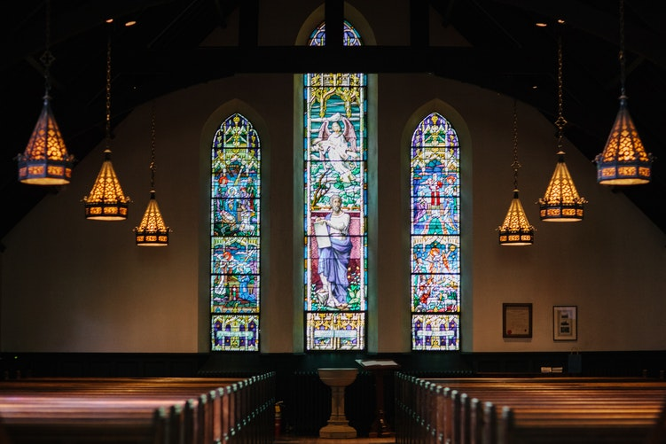
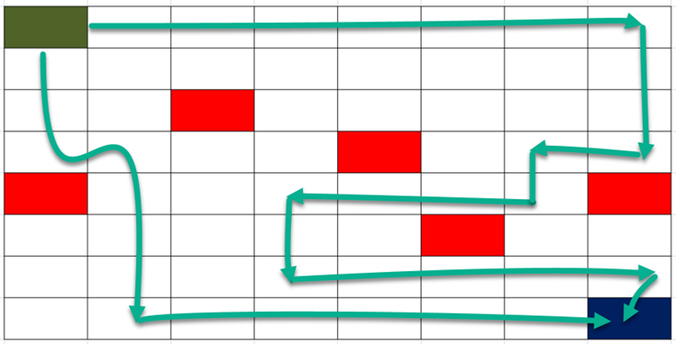

## OIT ITEC597 期中考试

### 代码提交方式
* fork此repository，完成代码编写后提交自己的GitHub Repository地址即可
* 为了方便对大家提交的代码进行统一测试打分，请务必保留`resolve`方法，可以
根据需要自由添加辅助类、辅助方法等
* POM依赖中不得添加任何其他类库
* 提交截止时间：May 18, 2019 23:59:59 PM PST


### 第一题：圣经学者的烦恼(4分)

* 难易程度：简单
* 背景说明：王江牧师惯于每日早晨在山中漫步默想，复活节后的第一个早晨，他研读英王钦
定本之时，忽然想基于圣经文本的词频来发掘其中潜藏的深意。逐节、逐词汇总统计工作量着
实太大，于是他找到你来帮助他解决这个问题。王江牧师只希望关注有意义的英文词汇，冠词、介词
等一概忽略不计，所以他额外提供了一份停词过滤表，方便你进行统计时将他们排除在外。

  考虑到圣经词汇量相当可观，王江牧师只关注出现频率最高的12个单词以及频率最低的12个单词。
* 编程要求：[BibleScholar.java](src/main/java/BibleScholar.java)，实现`resolve()`方法
* 数据来源：kjv.txt和stopwords.txt
* 输出格式：返回一个字符串数组，前12个为频率最高的单词，后12个为频率最低的单词。数组中
每个元素的格式如下：  
  ```
  ${word}:${count}
  例如：
  lord:7886
  ```
* 注意事项
  + 输出单词一律为小写
  + 考虑到我们只关注最高、最低各12个单词，词频信息汇总完毕之后，禁止直接对其排序


### 第二题：古旧的修道院(5分)

* 难易程度：中等
* 背景说明：谷红星牧师夫妇前往南美传教，正为OC地址愁苦之时，一位天主教修士忽然找到
他们，说某处有一古旧的修道院出售，是否考虑前去看看？  

  大喜过望的红星牧师立马赶到现场，很快他发现这确实是一所相当古旧的修道院，然而稍加整
理修缮，仍然可以妥善使用。他绘制了一份修道院内部结构图如下：
  ```java
  3 2 6 3 6
  1 8 4 1 4
  13 7 13 9 4
  3 0 2 6 5
  9 8 8 12 13
  ```
* 结构图说明  
这谜一般的结构图，根据红星牧师本人的说法，实际意味着：
  + 这是一所有25个独立房间的修道院
  + 各个独立房间可能连通，也可能被墙垣阻隔
  + 为了方便记录，红星牧师定义了四个方向：西1，北2，东4，南8
  + 以第一个房间为例，左、上有墙但右、下无墙，因而第一个房间与右、下均连通
  + 修道院外围都必须被墙包围保护，免去风雨之苦
  + 现在红星牧师开始思考，这一修道院内部有多少个连通的区域？
  + 最大的区域中包含多少个房间？
  + 为了方便未来规划，如果拆除且仅拆除一堵墙之后可以腾出最大空间，该空间会有多大？
  + 以及：我们应该拆除哪堵墙？
  + 考虑到施工的难易程度，当不同的墙垣拆除之后所得最大区域相等时，优先考虑左侧，其次考虑下方
* 编程要求: [Monastery.java](src/main/java/Monastery.java)，实现
`public int[] resolve(int[][] rooms)`这一方法，返回一个数组，该数组的每个元素依次是：
  + 第一个元素：修道院中联通的区域数
  + 第二个元素：最大的区域有几个房间？
  + 第三个元素：拆除一堵墙之后最大区域会有几个房间？
  + 第四、五、六个元素：待拆除的墙所在位置及方向


### 第三题：圣殿骑士的取款机(7分)

* 难易程度：中等
* 背景说明：为保护朝圣信徒而出现的[圣殿骑士团](https://en.wikipedia.org/wiki/Knights_Templar)，极有创意地发明了银行系统。他们允许旅客在出发前将钱币、财物
储存在某地，到达圣地之后即可在指定地点提取，这一定程度缓解了旅客因为随身携带过多财物而被抢劫甚至
杀害的概率。与此同时，各地的货币系统可能存在差异，导致旅客在不同地域所能兑换、提取的钱币形式都
不相同。现在，有一位历经千辛万苦到达耶路撒冷的信徒，正要前往圣殿骑士团的据点取回自己存储的钱币。
* 编程要求: [KnightsTemplarBank.java](src/main/java/KnightsTemplarBank.java)，实现
`public int[] resolve(int amount, int[] options) {`方法
  + amount为朝圣客需要提取的钱币数量
  + options为圣殿骑士团银行系统的不同面值，比如1、2、5、10、25
  + 返回圣殿骑士团银行职员可以提供给朝圣客的不同面值数量组合方式总数及最少钱币组合数。
  比如朝圣客需取回5个银币，那么可以有4种方法（5 * 1, 1 + 2 * 2，3 * 1 + 2，1 * 5）
  最少钱币数量的给予方式是1枚面值为5的硬币。这两个数值以数组形式返回：`{4, 1}`
  + 特定情况下可能无法完成提取，此时请返回`{-1, -1}`


### 第四题：使徒保罗的传教之旅(7分)

* 难易程度：中等
* 背景说明：使徒保罗一直渴望能够“直到地极，做主的见证”，虽然常有阻隔，但计划从未停止。
在哥林多代笔罗马书的德丢弟兄，自告奋勇要为使徒保罗设计一条最合理的传教路线。这一路线
起自耶路撒冷，终于当时人们心中的地极他施（今日之西班牙）。鉴于当时极端犹太教徒对保罗
恨之入骨，行进过程中不能不避开他们。除此之外，德丢计划选择最快捷的路线，面对巨大的地
图，德丢发现这是一个艰巨的任务，于是他一头扎入繁琐的计算当中。你能帮助他快速定位到所
有可能路线吗？此时我们暂不关注最优路线。
* 编程要求：[MissionTrip.java](src/main/java/MissionTrip.java)


实现`public int resolve(int[][] paths)`方法，找到使徒保罗从起点开始，走到终点的
所有路径总数。以二维数组模拟的地图中，使徒可以沿着上下左右四个方向前进，需要避开敌对
犹太群体(paths[i][j] = 1)的同时，不能重复经过已经走过的地点，示意图中绘制了若干可
能路线。